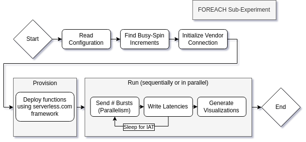
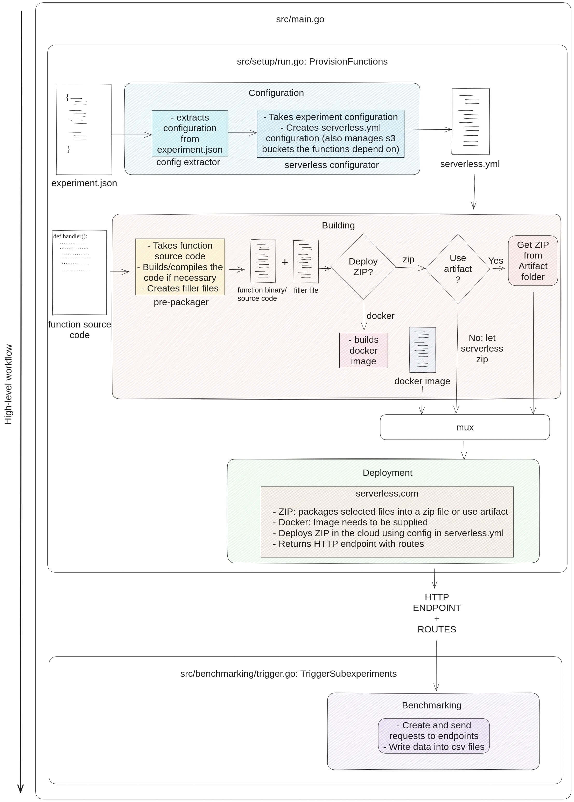

# 
[](https://github.com/vhive-serverless/stellar/actions/workflows/pipeline.yml) [](https://github.com/vhive-serverless/stellar/actions/workflows/image-build.yml)

Serverless computing has seen rapid adoption because of its instant scalability, flexible billing model, and economies of scale. In serverless,
developers structure their applications as a collection of functions invoked by various events like clicks, and cloud providers take responsibility
for cloud infrastructure management. As with other cloud services, serverless deployments require responsiveness and performance predictability manifested
through low average and tail latencies. While the average end-to-end latency has been extensively studied in prior works, existing papers lack a detailed
characterization of the effects of tail latency in real-world serverless scenarios and their root causes.

In response, we introduce STeLLAR, an open-source serverless benchmarking framework, which enables an accurate performance characterization of serverless
deployments. STeLLAR is provider-agnostic and highly configurable, allowing the analysis of both end-to-end and per-component performance with minimal
instrumentation effort. Using STeLLAR, we study three leading serverless clouds and reveal that storage accesses and bursty function invocation traffic
are key factors impacting tail latency in modern serverless systems. Finally, we identify important factors that do **not** contribute to latency variability,
such as the choice of language runtime.

## Referencing our work

If you decide to use STeLLAR for your research and experiments, we are thrilled to support you by offering
advice for potential extensions of vHive and always open for collaboration.

Please cite our [paper](docs/STeLLAR_IISWC21.pdf) that has recently been accepted to IISWC 2021:
```
@inproceedings{ustiugov:analyzing,
  author    = {Dmitrii Ustiugov and
               Theodor Amariucai and
               Boris Grot},
  title     = {Analyzing Tail Latency in Serverless Clouds with STeLLAR},
  booktitle = {Proceedings of the 2021 IEEE International Symposium on Workload Characterization (IISWC)},
  publisher = {{IEEE}},
  year      = {2021},
  doi       = {},
}
```

## Getting started with STeLLAR

STeLLAR can be readily deployed on premises or in the cloud. We provide [a quick-start guide](https://github.com/ease-lab/STeLLAR/wiki)
that describes the intial setup, as well as how to set up benchmarking experiments. More details of the STeLLAR design can be found in our IISWC'21 [paper](docs/STeLLAR_IISWC21.pdf)).


### Getting help and contributing

We would be happy to answer any questions in GitHub Issues and encourage the open-source community
to submit new Issues, assist in addressing existing issues and limitations, and contribute their code with Pull Requests.

### Continuous Benchmarking

We provide scheduled benchmarks for AWS Lambda, Azure Functions, Google Cloudrun and Cloudflare Workers daily, which can be found on our [dashboard](https://vhive-serverless.github.io/STeLLAR/). Currently, there are benchmarks for warm and cold function invocations.

## License and copyright

STeLLAR is free. We publish the code under the terms of the MIT License that allows distribution, modification, and commercial use.
This software, however, comes without any warranty or liability.

The software is maintained at the [EASE lab](https://easelab.inf.ed.ac.uk/) as part of the University of Edinburgh.


### Maintainers

* Dmitrii Ustiugov: [GitHub](https://github.com/ustiugov),
  [twitter](https://twitter.com/DmitriiUstiugov), [web page](http://homepages.inf.ed.ac.uk/s1373190/)
* [Theodor Amariucai](https://github.com/amariucaitheodor)
* [Dilina Dehigama](https://github.com/dilinade)
* [Min Kabar Kyaw](https://github.com/kk-min)
* [Yi Pun Wong](https://github.com/ypwong99)

## Design
To begin with, we provide an overview of our benchmarking solution and define the main terms used throughout the rest of the codebase:


- The coordinator orchestrates the entire benchmarking procedure.
- The experiment configuration is an input JSON file used to specify and customize the experiments.
- An endpoint is a URL used for locating the function instance over the Internet. As seen in the diagram, this URL most often points to resources such as AWS API Gateway, Azure HTTP Triggers, vHive Kubernetes Load Balancer, or similar.
- The vendor endpoints input JSON file is only used for providers such as vHive that do not currently support automated function management (e.g., function listing, deployment, repurposing, or removal via SDKs or APIs).
- The inter-arrival time (IAT) is the time interval that the client waits for in-between sending two bursts to the same endpoint. To add some variability and simulate a more realistic scenario, we sample this from a shifted exponential distribution. For example, if we set the IAT to 10 minutes (modeling cold starts for most vendors), generated values can be, e.g., 10m12s, 10m27s, 11m.
- Multiple endpoints can be used simultaneously by the same experiment to speed up the benchmarking. The JSON configuration field parallelism defines this number: the higher it is, the more endpoints will be allocated, and the more bursts will be sent in short succession (speeding up the process for large IATs).
- The latencies CSV files are the main output of the evaluation framework. They are used in our custom Python plotting utility suite to produce insightful visualizations.
- The logs text file (Figure 4.2) is the final output of the benchmarking client. Log records are useful for optimizing code and debugging problematic behavior.

## Flow Chart
Finally, we look at the procedural steps adopted by the framework:




1. The JSON configuration file is read and parsed, and any default field values are assigned. If the configuration file is missing, the program throws a fatal error.
2. Experiment service times (e.g., 10 seconds) are translated on the client machine into numbers representing busy-spin increment limits (e.g., 10,000,000). In turn, those are used by the measurement function on the server machine to keep the processor busy-spinning.
3. A connection with the serverless vendor is established. This is abstracted away behind a common interface having only four functions: ListAPIs, DeployFunction, RemoveFunction, and UpdateFunction. Used exclusively throughout the codebase, this interface offers seamless integration functionality with any provider.
4. In the provisioning phase, serverless.com framework is used to deploy the functions to the cloud and to establish HTTP endpoints. The functions are configured based on the experiment JSON file.
5. The last step runs all the experiments either sequentially or in parallel: bursts are successively sent to each available endpoint, followed by a sleep duration specified by the IAT. The process is repeated until all responses have been recorded to disk. Finally, statistics and visualizations are generated.

## Serverless.com Framework Deployment

Stellar uses serverless.com framework to deploy serverless functions to cloud.



1. The JSON experiment configuration file is parsed and serverless.yml service configuration file is written.
2. The function source code is compiled if needed. (e.g. Java and Go functions)
3. The filler file is created to increase the function deployment size. Filler files are added to the deployment package to benchmark performance of different functions with different sizes.
4. Based on the experiment deployment method:
    1. ZIP: serverless.com framework is able to zip the function with the filler file and no further steps are needed from STeLLAR. For better control over what gets zipped we allow the user to create "artifacts" - that is that STeLLAR zips the function and is provided to serverless.com already zipped. In such case, the serverless.com does not perform the zipping.
    2. Docker: Docker image is built - for this docker file needs to be provided by the user.
5. Serverless.com framework deploys the service defined in the service.yml. (`serverless deploy`)
6. Serverless.com return a list of endpoints and routes for every function defined.
7. Benchmarking is performed.
8. Once all the experiments are finished, the service is removed using the serverless.com framework. (`serverless remove`)

### Deployment boilerplate outline

Below are listed key packages and components that are most essential to serverless.com framework deployment.

- src/setup/
    - extract-configuration.go
        - Reads the experiment.json file and assigns values accordingly to Go Configuration struct.
    - assign-endpoints.go
        - Assigns endpoints and routes to each function deployed. Endpoint values are extracted from the Serverless
          framework deploy message and stored in the Configuration struct.
    - serverless-config.go
        - Creates the serverless.yml file based on the data in the experiment json file.

- src/setup/building/
    - This package takes builds Go binaries and Gradle projects for Java deployment.
- src/setup/code-generation/
    - This package generates Hello World provider-specific function source-code used for deployment.
- src/setup/deployment/packaging/
    - This package creates filler files, zips function packages and creates artifacts.
- src/setup/deployment/connection/
    - This package contains legacy code from the original deployment implementation, which used provider specific APIs.
      Most of this package will be eventually obsolete and deprecated, but we may get use of some of its
      functionalities.
- src/setup/deployment/raw-code/serverless/
    - This directory contains the logic of the functions that are to be deployed.
    - Each subdirectory contains source code resources for deploying to a specific provider (aws, azure, alibaba, gcr).
    - The serverless.yml file is stored inside each provider's subdirectory.
    - Function source code is stored in each provider’s subdirectories (e.g. aws/hellogo, azure/hellopy).


### Serverless.com & Cloud Provider Capabilities
While serverless.com framework is a powerful tool when it comes to deploying Lambda Functions to AWS, its capabilities are more limited with other providers. The following table shows serverless.com features vs. different providers whose deployment was considered to be automated.

|                                              | AWS Lambda | Azure Function                           | Google Cloud Run | Knative | Google Cloud Function *                  | Alibaba                                  |
|----------------------------------------------|------------|------------------------------------------|------------------|---------|------------------------------------------|------------------------------------------|
| Deploy function - zip                        | Yes        | Yes                                      | No               | N/A     | Yes                                      | Yes                                      |
| Deploy function - docker                     | Yes        | No (documentation does not mention it)** | No               | Yes     | No (documentation does not mention it)** | No (documentation does not mention it)** |
| Python Runtime                               | Yes        | Yes                                      | No               | Yes     | Yes                                      | ??**                                     |
| Go Runtime                                   | Yes        | No                                       | No               | Yes     | Yes                                      | ??**                                     |
| Java Runtime                                 | Yes        | No                                       | No               | ??**    | No                                       | ??**                                     |
| Node JS                                      | Yes        | Yes                                      | No               | Yes     | Yes                                      | Yes                                      |
| HTTP trigger                                 | Yes        | Yes                                      | No               | Yes     | Yes                                      | Yes                                      |
| Resource Management (e.g. buckets databases) | Yes        | Yes (at least it looks like it)          | No               | ??**    | ??**                                     | ??**                                     |
| Serverless framework support                 | Yes        | Yes                                      | No               | Yes     | Yes                                      | Yes                                      |

*experimental version, not meant for production yet

**needs to be empirically verified

## Data Transfer Measurement
We integrate all necessary server-side functionality into a single function that we call a _measurement function_. This approach is similar to that taken in [40] and other serverless performance evaluation frameworks. A measurement function can perform up to three tasks, depending on the use case:

1. It always collects function instance runtime information.
2. If applicable, the function will simulate work by incrementing a variable in a busy-spin loop. This can be as simple as “for i := 0; i<incrementLimit; i++{}”.
3. If applicable, the function records invocation timing. This is particularly useful for our data transfer studies where we complement client-measured round-trip time with internal function timestamps for validation purposes.


