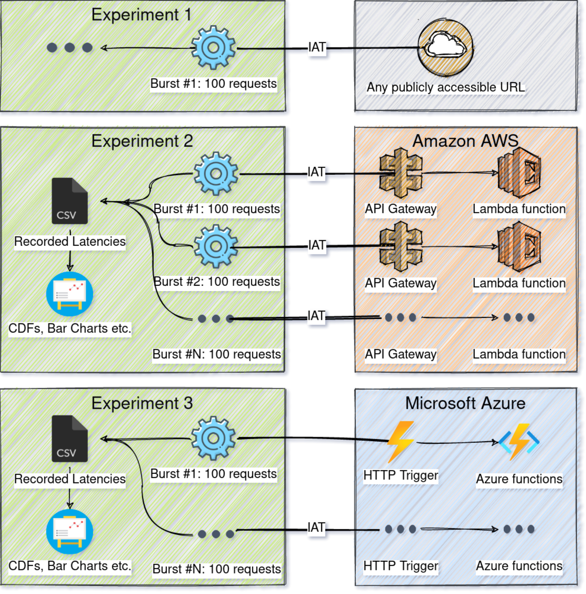
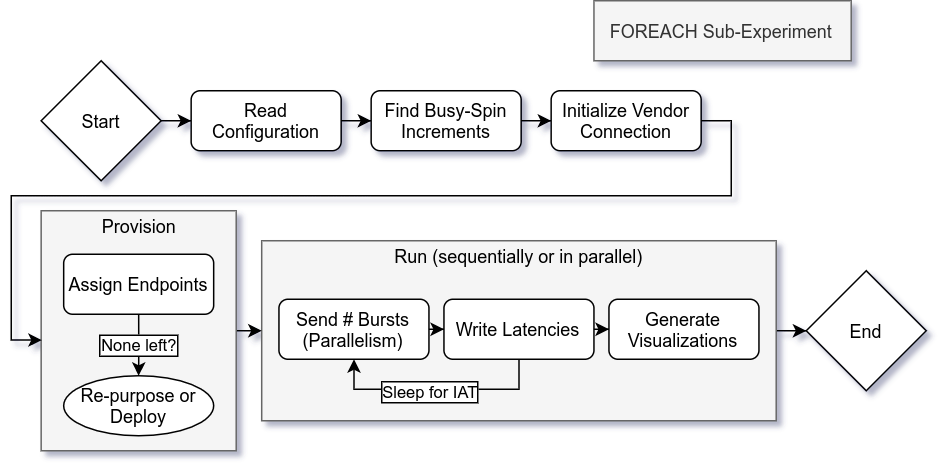

## Benchmarking Client 
This client tests the performance of 
AWS Lambda busy-spinning microVM functions by sending requests and benchmarking the
latencies. 

### Parameters
- `o` (default "latency-samples"): The directory path where latency samples should be written.
- `c` (default "config.csv"): Configuration file specifying what experiments the client should run (details below).
- `g` (default "gateways.csv"): File containing ids of gateways to be used.
- `r` (default -1): Client will only run this particular experiment.
- `l` (default "info"): Client will use this level for logging information.

### Configuration example 
Examples of valid experiment configurations you can find in folder `experiments`. Below is a table and a further discussion
 about the main elements of a configuration.

| Title        | Bursts | BurstSizes | IATType       | PayloadLengthBytes     | DesiredServiceTimes    | CooldownSeconds     | GatewaysNumber | Provider        | Visualization | FunctionMemoryMB
|--------------|--------|------------|---------------|------------------------|------------------------|---------------------|----------------|-----------------|---------------|-----------------
| google       | 5000   | [1]        | deterministic | 0                      | ["50ms"]               | 1                   | 1              | www.google.com  | all           | 500
| check1       | 50     | [100 10]   | stochastic    | 5                      | ["100ms"]              | 300                 | 150            |                 | cdf           | 1500
| check2       | 1000   | [5 1 3]    | step          | 5                      | ["400ms"]              | 600                 | 100            | aws             |               | 300

- `Title` Title of each experiment (used for naming folders).
- `Bursts` Number of bursts which the latency profiler will trigger.
- `BurstSizes` Number of requests to send in a burst.
- `IATType` (default `stochastic`) Whether the inter-arrival time should be `deterministic`, a `step` function or `stochastic` (Gaussian).
- `PayloadLengthBytes` Length of the payload generated by the lambda function(s).
- `DesiredServiceTimes` Service times for the lambda function(s) to busy spin on.
- `CooldownSeconds` Frequency at which the latency profiler operates.
- `GatewaysNumber` (default `1`) Integer representing how many gateways to use from the gateways file for this sub-experiment.
- `Provider` (default `aws`) String representing the provider to be benchmarked (`aws`, misc. hostname).
- `Visualization` (default `cdf`) The type of visualization to create (`histogram`, `cdf`, `bar`, `all`, `none`).
- `FunctionMemoryMB` (default `128`) How much memory should the benchmarked function use.


## Design


## Flow Chart


## Provider Limitations

### AWS
- Code storage limit
```
Cannot update function code: CodeStorageExceededException: Code storage limit exceeded.
{
  RespMetadata: {
    StatusCode: 400,
    RequestID: "886339b1-63ae-4f80-a923-7c1ed4201b6e"
  },
  Message_: "Code storage limit exceeded.",
  Type: "User"
}
```

- Regional APIs limit `600`