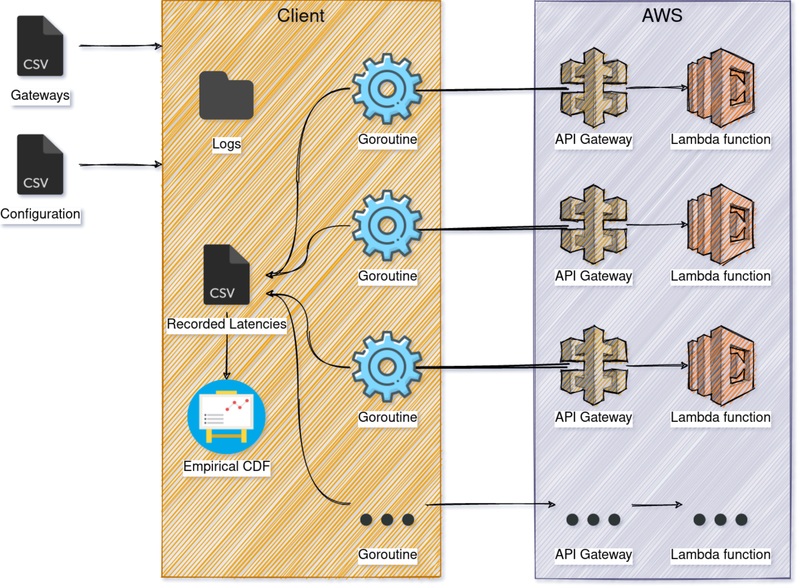

## Benchmarking Client
This client tests the performance of 
AWS Lambda busy-spinning microVM functions by sending requests and benchmarking the
latencies. 

### Design

### Parameters
- `visualization` (default "all"): The type of visualization to create (per-burst histogram "histogram" 
or empirical CDF "CDF").
- `outputPath` (default "latency-samples"): The directory path where latency samples should be written.
- `configPath` (default "config.csv"): Configuration file specifying what experiments the client should run (details below).
- `gatewaysPath` (default "gateways.csv"): File containing ids of gateways to be used.
- `runExperiment` (default -1): Client will only run this particular experiment.
- `logLevel` (default info): Client will use this level for logging information.

### Configuration example 

| Bursts | Burst Size | IAT Type      | Payload Length (bytes) | Lambda Increment Limit | Frequency (seconds) | Gateways | Provider
|--------|------------|---------------|------------------------|------------------------|---------------------|----------|---------
| 5000   | 1          | deterministic | 5                      | 310000000              | 1                   | 50       | www.google.com
| 50     | 100        | stochastic    | 5                      | 650000000              | 300                 | 150      | aws
| 1000   | 5          | step          | 5                      | 1350000000             | 600                 | 100      | aws

- `Bursts` Number of bursts which the latency profiler will trigger.
- `Burst Size` Number of requests to send in a burst.
- `IAT Type` Whether the inter-arrival time should be `deterministic`, a `step` function or `stochastic` (Gaussian).
- `Payload Length (bytes)` Length of the payload generated by the lambda function.
- `Lambda Increment Limit` Increment limit for the lambda function to busy spin on.
- `Frequency (seconds)` Frequency at which the latency profiler operates.
- `Gateways` Integer representing how many gateways to use from the gateways file.
- `Provider` String representing the provider to be benchmarked (`aws`, misc. hostname).

## tmux tips
- To create a new session `tmux new -s cloudlab`
- To list sessions `tmux ls`
- To detach from session `C-b d` or `tmux detach`
- To re-attach to session `tmux attach -t cloudlab`
- `Ctrl-b %` for horizontal split, `Ctrl-b "` for vertical split
- `Ctrl-b c` to create a new window, `C-b p` and `C-b n` to navigate them
- WARNING `Ctrl d` to exit a pane/window